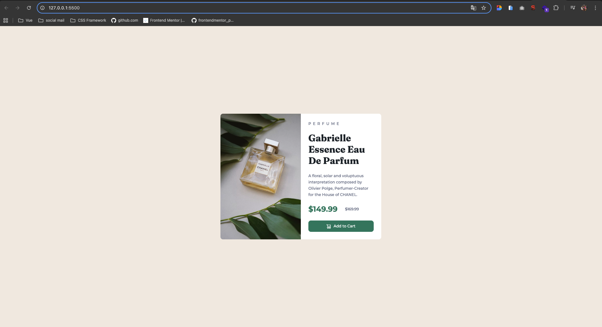
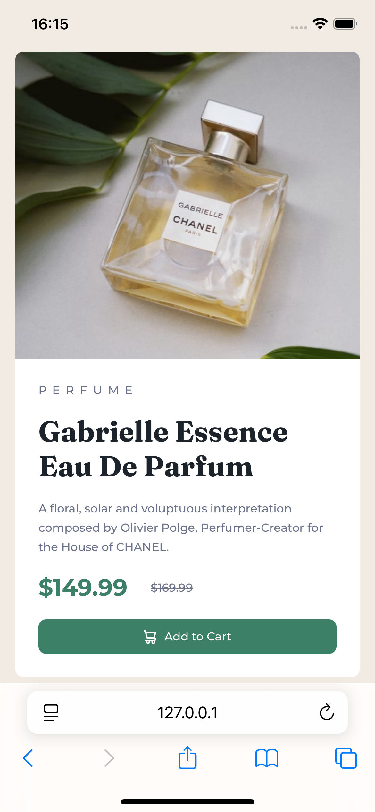

# Frontend Mentor - Product preview card component

## Table of contents

-   [Overview](#overview)
    -   [Screenshot](#screenshot)
    -   [Links](#links)
-   [My process](#my-process)
    -   [Built with](#built-with)
    -   [What I learned](#what-i-learned)
    -   [Continued development](#continued-development)
    -   [Useful resources](#useful-resources)
-   [Author](#author)

## Overview

### Screenshot

#### Desktop

#### Mobile

### Links

-   Solution URL: [https://github.com/Noppakalo/Product-card.git](https://github.com/Noppakalo/Product-card.git)
-   Live Site URL: [https://noppakalo.github.io/Product-card/](https://noppakalo.github.io/Product-card/)

## My process

### Built with

-   Flexbox
-   Mobile-first workflow
-   Semantic HTML5 markup
-   [Tailwind CSS](https://tailwindcss.com/) - Css Framework

### What I learned

-   Write tailwind css

 <main class="container flex items-center justify-center m-auto h-svh">
            

                
                

                    

                        PERFUME
                    

                    <h1>Gabrielle Essence Eau De Parfum</h1>
                    

                        A floral, solar and voluptuous interpretation composed
                        by Olivier Polge, Perfumer-Creator for the House of
                        CHANEL.
                    

                    

                        

                            $149.99
                        

                        

                            $169.99
                        

                    

                    <button
                        class="bg-[var(--green500)] px-4 py-2.5 rounded-lg text-xs text-white font-medium cursor-pointer hover:bg-[var(--green700)]"
                    >
                        Add to Cart
                    </button>
                

            

        </main>

-   Responsive design support all device

### Continued development

-   CSS Animations
-   Accessibility (a11y)

### Useful resources

-   [Google Fonts](https://fonts.google.com/) - Used the Outfit font family from here for this project.
-   [Tailwind CSS](https://tailwindcss.com) - Used style css from project

## Author

-   Frontend Mentor - [@Noppakalo](https://www.frontendmentor.io/profile/Noppakalo)
